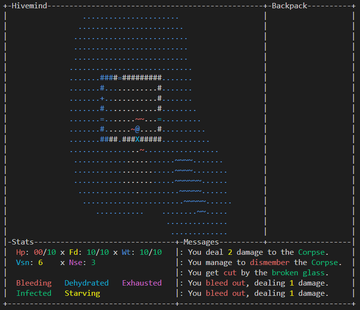

Title: Hivemind

Author: @elly (cmdrapollo)

Source code: https://github.com/cmdrapollo/hivemindrl

### Day 1 (August 1)

No work was done this day.

Time spent today: **0 hours**

### Day 2 (August 2)

No work was done this day.

Time spent today: **0 hours**

### Day 3 (August 3)

No work was done this day.

Time spent today: **0 hours**

### Day 4 (August 4)

Work started this day around 10pm. I decided to use curses and make a survival based trad RL in the vein of Cataclysm DDA or even something like project zomboid. Today, i worked on simple rendering and input loops, as well as some tentative UI elements. The player can move and collide with certain tiles, and there is very simple level generation in place, which i intend to expand on tomorrow. Overall, not much got done, but i'm fairly happy with my progress regardless.

Time spent today: **3 hours**

### Day 5 (August 5)

Work started this day right at midnight. Today I worked on better map generation including buildings with windows and doors. I also worked on the noise system that will be integral to gameplay. I added a simple animation for when you get hurt, as well as the ability to bleed out and get infected when walking over bloody tiles. I will probably work for another hour or so tonight (it is past midnight), and I intend to get the rest of the status effects implemented so that tomorrow when I wake up I can begin working on enemies/pathfinding. After that will be crafting/items/inventory, as well as combat. Not sure if I will get to that tomorrow, though. I'm not particularly happy with my progress from today, but hopefully I can turn that around in this next hour.

Time spent today: **4.5 hours**