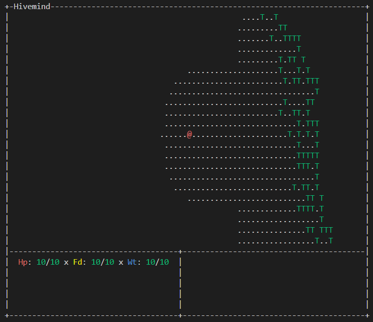

Title: Hivemind

Author: @elly (cmdrapollo)

Source code: https://github.com/cmdrapollo/hivemindrl

### Day 1 (August 1)

No work was done this day.

Time spent today: **0 hours**

### Day 2 (August 2)

No work was done this day.

Time spent today: **0 hours**

### Day 3 (August 3)

No work was done this day.

Time spent today: **0 hours**

### Day 4 (August 4)

Work started this day around 10pm. I decided to use curses and make a survival based trad RL in the vein of Cataclysm DDA or even something like project zomboid. Today, i worked on simple rendering and input loops, as well as some tentative UI elements. The player can move and collide with certain tiles, and there is very simple level generation in place, which i intend to expand on tomorrow. Overall, not much got done, but i'm fairly happy with my progress regardless.

Time spent today: **3 hours**